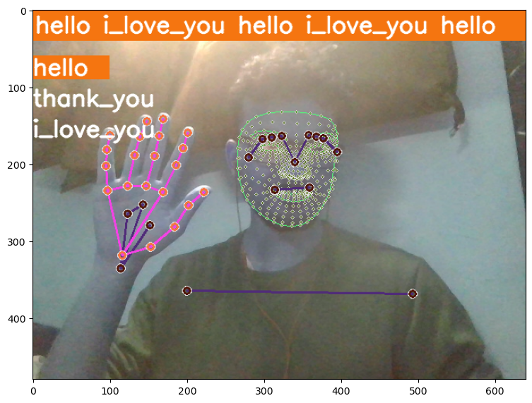

# Sign Language Estimation using MediaPipe and TensorFlow LSTM Model



## Overview
This project aims to create a system for estimating sign language gestures using MediaPipe for hand and head movement tracking and TensorFlow for building and training an LSTM (Long Short-Term Memory) model. The system focuses on detecting and interpreting the signs for "hello", "thank you", and "I love you".

## Features
- Utilizes MediaPipe to track hand and head movements frame by frame.
- Implements a TensorFlow LSTM model to learn sign language gestures.
- Trains the LSTM model on labeled data for accurate recognition of "hello", "thank you", and "I love you" signs.

## Requirements
- Python
- TensorFlow
- MediaPipe
- NumPy
- Matplotlib

## Installation
Clone the repository:
   ```
   git clone https://github.com/your_username/sign_language_estimation.git
   ```

## Usage
Follow the instructions to perform the signs for "hello", "thank you", and "I love you".

The system will attempt to recognize the signs based on the hand and head movements captured by the webcam.

## License
This project is licensed under the MIT License - see the [LICENSE](LICENSE) file for details.

## Acknowledgement
This project was made possible because of [this](https://www.youtube.com/watch?v=doDUihpj6ro&list=PLgNJO2hghbmid6heTu2Ar68CzJ344nUHy&index=2) lecture by Nicholas Renotte.

---
Feel free to customize and extend the script according to your specific needs!
